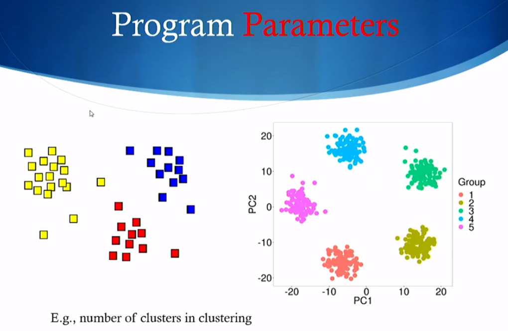
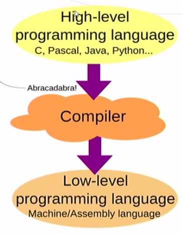
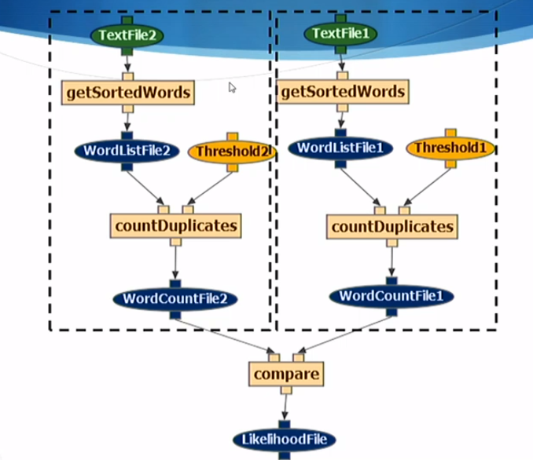

# Lecture2 Note

## Programs Implement Functions

      Definition: Function is a type of procedure or routine.

Example of function:

## Inputs and Outputs of Programs
Clear what are the inputs of the program and what are the outputs of the program.

## Program Parameters

   - Parameters are the **special inputs**, which are the necessary context for the program to run. (But not every program needs prameters)
   - Parameters can be chose **by youself** or set the **program to choose** a random parameter or optimize the parameter based on some **other functions**.
 
E.g., number of clusters in clustering:

Treating Programs as **"Black Boxes"**
   - Don't have to understand complex programming in order to use software
   - This is why we often refer to sofrware as a "black box"
   - Only need to understand inputs and outputs and the program's function

## Compilers
 Translate Advanced programming language into machine language.

## Turing-complete

1. **Turing machines** -- mathematical framework to understand computing machines
   - They can be used to study how an algorithm works

2. A programming language is turing-complete if it is possible to **implement a turning machine in that languate**
   - They must include special instructions such as loops, iterations and conditional statements.

3. All programminglanguages are Turing-complete and there they are **computationally equivalent**
   - The differences among them are in the ease of use for implementing specific functions.

## Algorithms

An algorithm is as mechanical procedure that describes how to carry out a computation on some data (the logic)

## Workflow & Computational Workflows
A Workflow is a Composition of Functions

1. Workflow is represented as a graph of connected nodes
   - Nodes represent programs and data
   - Links represent how data flows from program to program
2. Computatinal workflows are compositions of programs
   - No user interaction during execution
   - No cycles/loops or iterations allowed

Workflow Example:

Document Similarity

## Repeatability & Reproducibility & Replication

1. Repeatability : **the same lab** can **re-run** an analysis and get the **same results**
    - Not so obvious due to new versions of software.
    - Can collect **new data**, which is called **In-lab Replication**.

2. Reproducibility : **another lab** can run analysis with the **same/original data** and get the **same result**s
    - Original lab must share their data directly or make it available for download.
3. Replication: **another lab** can **re-run study** and get the **same results**
    - Original lab has to document in detail what was done.
    - Different lab uses the same methods and new dataset to try to "replicate" the finding.

|  |OG User| New User |
:-:|:-:| :-:|
| **OG Data** |Repeatability | Reproducibility|
|**New Data**| In-lab Replication | Replication|

  
