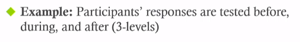

## Logic and Probability For Statistics

### Descriptive Statistics

1. What is a **Mean (M) ?**
   - Measurement of **central tendency**
   - Mathematical midpoint (average) of a data set
2. Standard Deviation (SD)
   $$SD = \sqrt\frac{\sum(X -\overline{X})^2}{N}$$
   - Measurement of variability
   - How variable is the data
   - How close to the mean is a given value

            Target of descriptive statistics:
            Descriptive statistics can be run on the entire target and take a sample is the usually method.
            Use the sample M and SD of an enough sample size to represent the entire target's statistics.
3. NHST (Null hypothesis significance testing)
   A **systematic procedure** for deciding whether the **outcome** of a study (results from a sample) **support** a particular theory (which is thought to apply to a population)  
   
   
If you want to draw a conclusion about a population, your sample better be from that population.
4. Probability
   - Definition: The expected relative frequency of a particular outcome
     - Relative frequency - # of times something happens relative to # of times it could have, like 4/10
     - Expected relative frequency (**probability**)
   - Probability = $p$ = $\frac{X\,ways\,to\,get\,an outcome}{Y\,possible\,outcomes}$  = expected relative frequency
   - proportion: 0 - 1
5. **NHST** uses **deductive reasoning**
   - Deductive Reasoning: From general to specific - Theory to hypotheses
   - Inductive Reasoning: From specific to general - Observations to theories
   - P<0.05

            We have to find one false case to disprove

6. Normal Curve
   
   - Unimodal, symmetrical, bell-shaped curve
   - Mathematical (or theoretical) distribution
   - 34-14-2
   - p<0.05 (below -1.96 & above 1.96)
7. Z-Scores (标准化)
   A Z-score is the number of standard deviations the score is above or below the mean.
   - Standardization: Process of converting raw scores into Z-scores
   - Formula:$\frac{X-\overline{X}}{SD}$

8. Sampling Distribution

       One individual -> distribution of individual scores
       Mean -> distribution of means

   - Standard Error (SE)
   Measurement of variability of samples (Mean of means)
   Z-score computing formula:
   $$Z = \frac{(M - \mu_m)}{\sigma_m}$$
   $\mu_m$ = mean of the distribution of means
   $\sigma_m$ = standard deviation of the distribution of means aka "standard error (SE)"

### Inferential Statistics

1. Practical Significance
   - Statistical significance does not guarantee the result is meaningful
   - Strong significance (p<0.001) means a reliable effect, not necessarily a strong effect
2. Effect Size
   An effect size is a measure of the strength of the relationship between two variables. Most commonly reported effect size is Cohen's $d$
   

   ||Small effect|Medium effect|Large effect|
   |:-:|:-:|:-:|:-:|
   |$d$|0.2|0.5|>0.8|

   

3. Types of statistical tests
   ||Continuous predictor (e.g, how much)|Categorical predictor (e.g, exp vs control)|
   |:-:|:-:|:-:|
   |**Continuous outcome(e.g, how much)**|Correlation or regression|T-test or ANOVA|
   |**Categorical outcome (e.g, yes/no)**|logistical regression|chi-square test or loglinear|

4. t-tests

       Simple test for comparing groups
       independent samples t-test vs. paired samples t-test

   e.g, t(18) = 19.06, p = 0.0001  "18" is **degrees of freedom**, "19.05" is **t-value**, "0.0001" is significance

   - Independent Samples t-test
     - Compares two independent groups
     - One example:
  
   - Paired-Samples t-test
     - Compares one (the same) group that has been tested twice
     - Before and after; under two different conditions
     - One example:
  

5. Analysis of Variance (ANOVA)
   
       Used when experiment has a more complex design.
       (variables with more than two levels, multiple predictor variables)
   - One-way ANOVA
     - Used when the predictor variable has more than two levels
     - One example:
  
   - Repeated measures ANOVA
     - Used when group has been tested more than twice
     - One example:
  
   - Factorial ANOVA
     - Used for multiple predictor variables (one of more can be repeated measures)
     - Each variable has a main effect
     - Variables can have interactions effects

6. Chi-Square
   - Used to analyze categorical (count or proportion) data
7. Correlation coefficient
   - Used to represent the relationship between two continuous variables. 
