

## Geography

The study of the Earth and its systems. inhabitants, and processes

1. Physical Geography: the study of the Earth's environmental processes
2. Human Geography: the study of people and how their activities vary
3. Environmental Studies: the systematic study of human interactions with the environment (to solve complex problems)
4. Geomatics: the collection, distribution, storage, analysis, processing, and presentation of geographic data or information
5. Urban/Regional Geography

## Cartography

The study and practice of making maps; develops theories for visualizing and communication

## Geospatial

Often thoughts of as a synonym for 'geography' but has a technological component and connotation

## Space
- A Euclidean concept of an empty container within which the world exists 
- Counter-concept is relational space
- And not to be forgotten is liminal space

## Landscape

- The appearance of the physical world; A visual realm
  - Like nature, first studied as something fixed, as a 'natural' realm
  - Later, cultural landscapes were recognized
  - Then, considered as a "way of seeing" stemming from the tradition of European landscape painting and gardens; the creation of a manufactured natural sphere over which a person can claim control 

## Place

- A 'bounded locale'; more humanistically; A sense of place
- Can be subjective to feelings and identify

## The Abstraction Process
- Abstraction is the process by which we represent the real world in the digital environment
- The real world si infinitely complex and full
- The digital environment is highly ordered, made up of lines of code - what is called a formal environment

## Conceptual Models of GIS

#### Object Model
- Aspects of the physical world are conceptualized as **discrete** objects
- In the mindset of Euclidean space, we conceive of the world as the empty backdrop in which objects exist

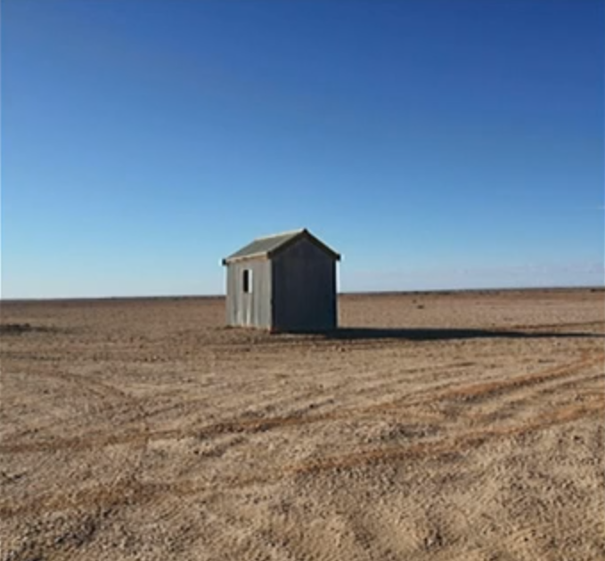

#### Field Model
- We conceive of some aspects of the world as **continuous** features of varying values

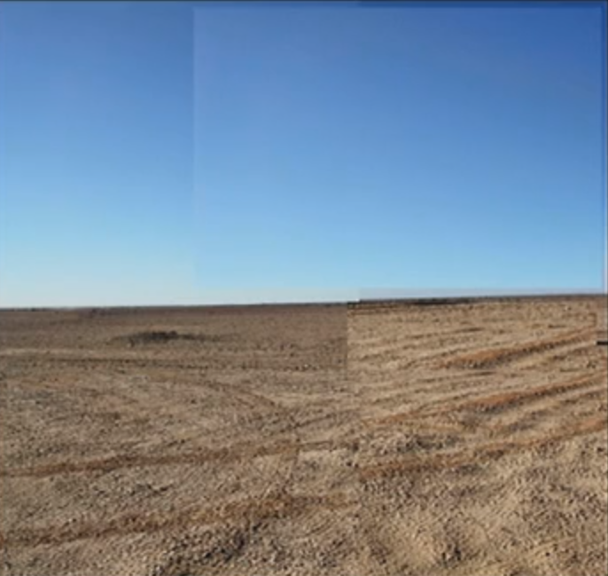

## Spatial Data Models

## Components of Spatial Data

1. Spatial data:
   Describes the location of spatial features

2. Attribute data:
   Describe the characteristics of the spatial features

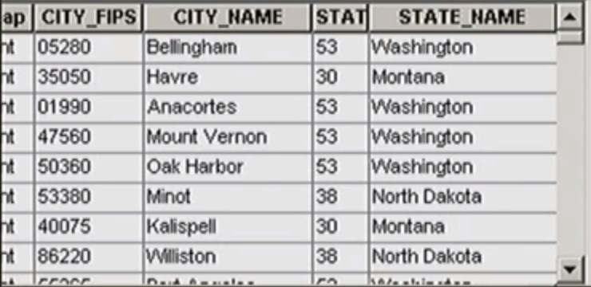

## From Conceptual to Spatial Data Models

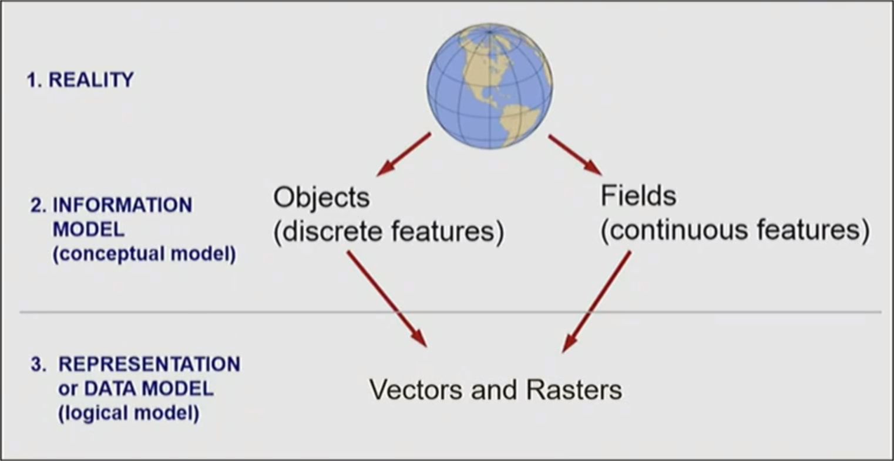

## Vector and Raster

- The **vector** data model stores real world phenomenon as individual objects in a data layer
- The raster data model stores real world phenomenon as fields in a grid, much like pixels in an image

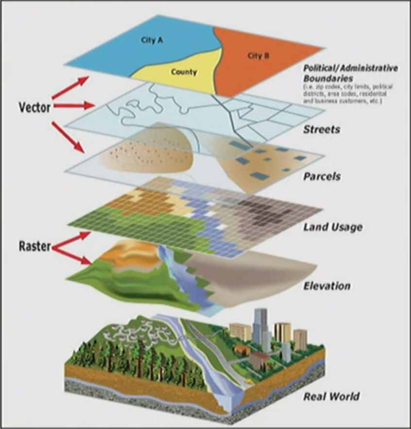

### Coordinate Pair = Location Only
- Coordinate pairs have location only and no area stored with the spatial data
- Points are just a coordinate pair of location
- Like points, lines do not have an area associated with them; they are visible on a map only if we symbolize the line segments with a width.
- Polygon do have the area associate with it.

### Vector

#### What is Vector
- Geographic features are classified as either a point, line, or polygon
- Points, lines, and polygons are defined by one or more coordinate pairs
- Lines are a series of pairs that define line segments
- Polygons are a serious of pair which circle back to meet  

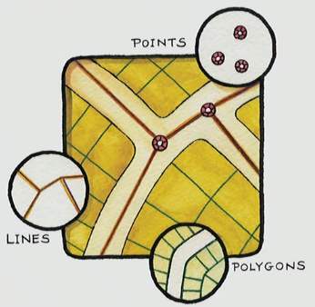

- Vector are used to represent discrete objects: buildings, streets, governmental boundaries.
- Vector's Where and what
  - Where of vector is the (x,y) coordinates
  - What of vector are attributes, stored in an attribute table

#### Vector Files

1. A single vector file can not contain a combination of points, lines, and polygons
2. A single vector file must contain only either point OR line OR polygons
   
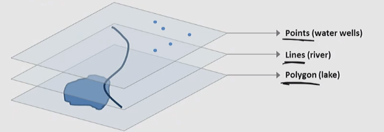

### Raster

#### What is Raster
- The physical world is recorded as an array of cells(pixels), with a location and value
- Rasters of spatial data are thus modeled as with photography, in which a smooth image is created from thousands fo individual pixel
  
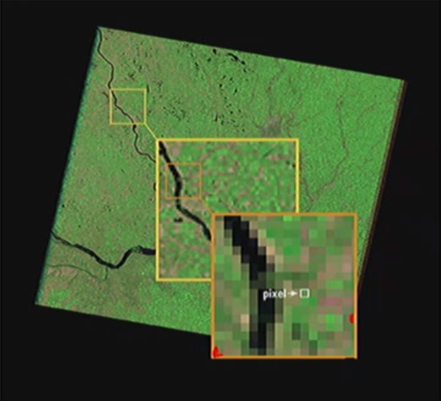

- Raster's **Where and What**
  - The where of raster is the (x,y) coordinate pair of just one corner of the grid. With the resolution(cell size) of the raster, you can work out the location of any single cell based on its grid position
  - The what of raster is the value of particular cells, stored in the same file or linked table

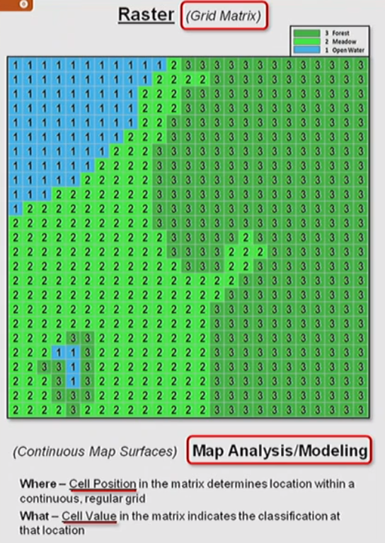

#### From Real World to Raster

- The phenomenon in the image must be represented by grid of individual cells
- First, the size of cells must be decided
- Each cell needs to be **categorized** as either white or peach
  - Rules for Category Selection
    - **majority rule**: majority of the cell becomes the whole cell (A)
    - **Central point rule**: value at the center of the cell becomes the whole cell (B)
    - **Grid corner rule**: if any NW grid corner is [chosen value], the cell is [chosen value] (C)

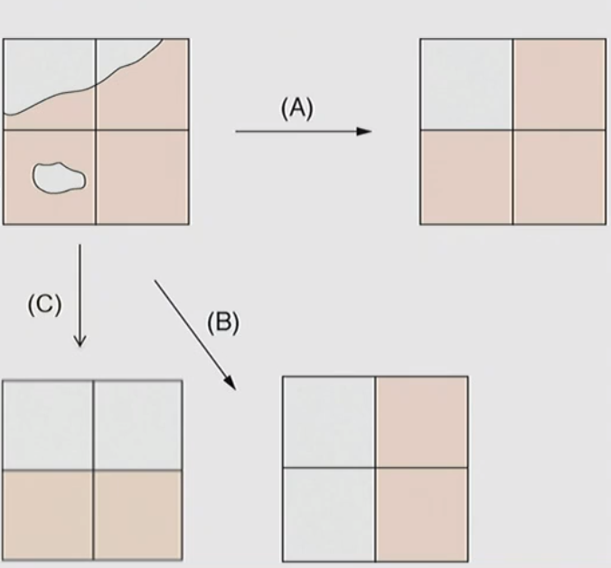

#### Precision of Raster Data
- Higher precision = smaller cells, more pixels(cells) per area, more precise, larger file size
- Lower precision = larger cells, fewer pixels per area, less precise, smaller file size

#### Raster Model Fields
 Raster are suited to representing continuous phenomena that we conceive of as fields such as elevation

## Other Spatial Data Model
### The TIN (Triangular Irregular Network) Data Model
- vector-based data that is created by triangulating a set of vertices to create a continuous surface
  - Minimum interior angle of all triangles is maximized - no long, skinny triangles
- Best for surface morphology

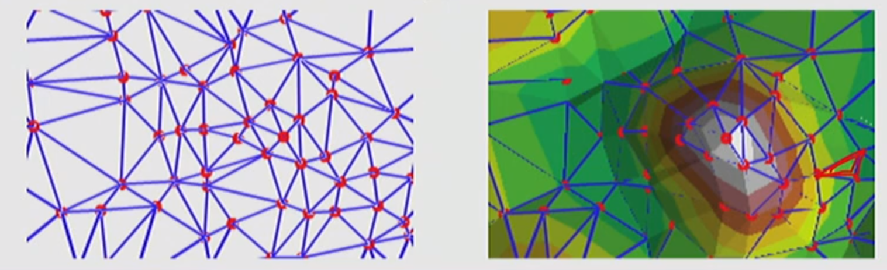

### Fuzzy Data Model
 When membership in just one class cannot be delineated in the physical world (e.g. soils)

## Tobler's First Law of Geography

    "Everything is related to everything else, but near things are more related than distant things"
- This law states a key principle for why geography is important and why spatial data and spatial analysis is powerful
- We can use the spatial nature of a phenomenon to understand it better and to learn about other phenomena

### Distance
- Distance / nearness is the spatial concept called out explicitly in Tobler's first law and is clearly the most basic way we might consider phenomena to be spatially related
- Earth is ellipsoidal so many distances we want to measure actually exist on a curved surface
- Straight line might not the actual line (e.g. navigation)

### Adjacency / Contiguity

- Place that are next to each other; places taht share a border
- A binary measurement
- Area within adjacent spatial entities can also be distant
- Rook's case: features sharing an edge are neighbors
- Queen's case: features sharing an edge OR a node are neighbors

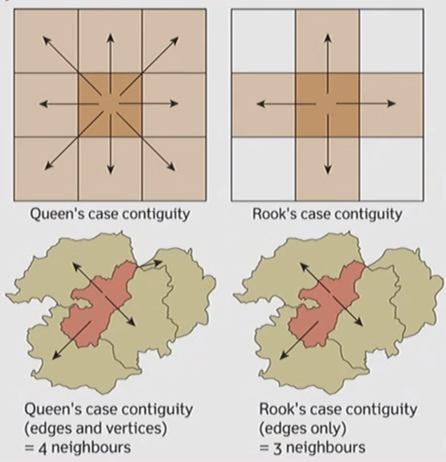

### Inverse Distance Weighting

- The spatial relationship between entities is often accounted for in spatial analyses using the inverse of the distance between them as a weight:
$$ \frac{1}{d^k}\rightarrow w_{ij}$$ 
- An attribute of interest for the two entities (such as population or area) could be used to positively impact the weight
$$\frac{p_ip_j}{d^k} \rightarrow w_{ij}$$

### Proximity Triangles; Nearest Neighbor
- Other methods of assessing spatial relationships consider the closest neighbor or the closest of a different entity, e.g. the proximity polygon method

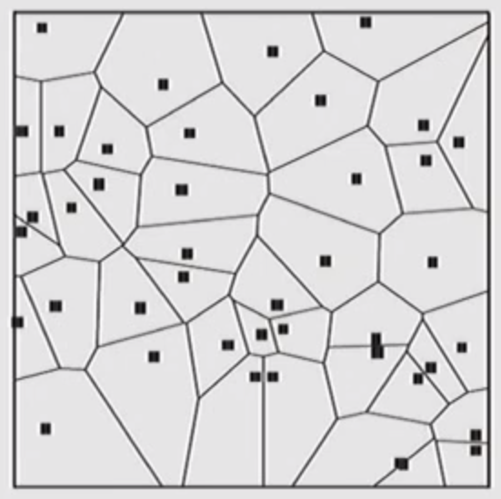

## Spatial Autocorrelation and Spatial Heterogeneity

### Spatial Autocorrelation
- A measure of the relationship between the value of a variable at a location and the same variable but at another location separated by some specified distance
- Another way: Spatial autocorrelation is a measurement of Tobler's First Law. Spatial autocorrelations test and measure this assumption for different types of spatial objects, processes, and events

- After the measurement of the spatial autocorrelation, you will get:
  - Positive value (Clustered)
  - Negative value (Dispersed)
  - Zero (Random)

### Spatial Heterogeneity
- Everywhere is not the same; we use an uneven distribution of features and variables
- The temperature could be different on the two sides of a mountain; But it also could be the same across a vast desert

## Modifiable Areal Unit Problem (MAUP)

### What is MAUP

    When (point) data are aggregated, how the data are aggregated will greatly influence the result and can change the outcome

### Two Type of Effects

#### Scale Effect
 When point data are aggregated at a certain areal unit, or when data from one scale are analyzed at another (size of the areal unit changes)

 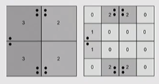

#### Zonal Effect
 When different boundaries of the aggregated data change the outcome; the way in which the data are assembled at a given scale changes

 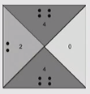

