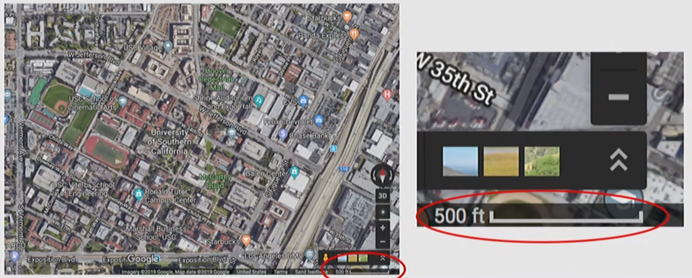
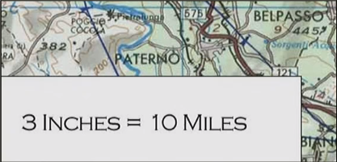
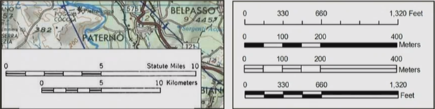
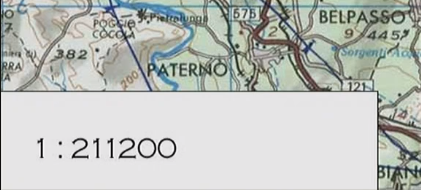
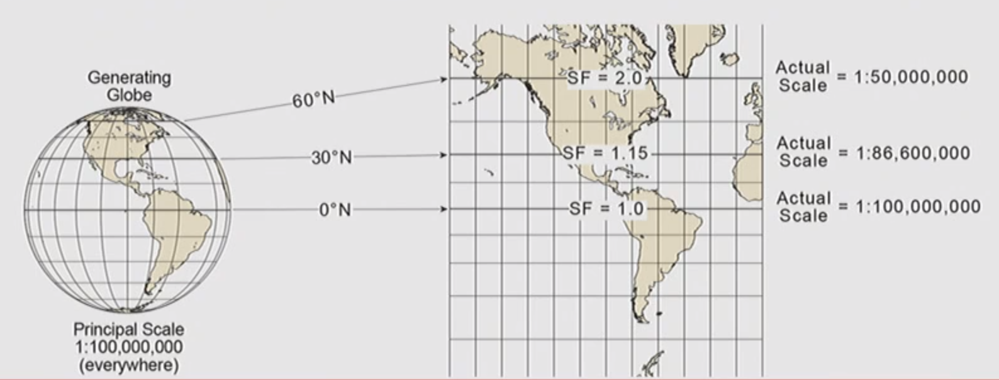

# Scale

## The Concept of Scale
- Scale is the size or extent of something
- The temporal scale is the length of time
- The spatial scale si the physical size or extent

## Spatial Scale
### 1. Cartographic Scale
- The ratio of the distance on the map to the distance in the physical world
- **Three types** of Cartographic Scale:


<!-- tab Verbal (word) scale -->
- WordS describe **UNITS of distance on map** compare to **UNIT of distance in physical world**
- Rarely used outside printed paper maps

<!-- endtab -->

<!-- tab Graphic (scale bar) -->
 - Scale bar visually equates a map distance (No UNITS) to a distance in the physical world (WITH UNITS)
 - Still works if you enlarge a static map (a paper map or an image of a map)

<!-- endtab -->

<!-- tab Representative fraction (RF) -->
 - Ratio of map distance (NO UNITS) to physical distance (NO UNITS)

<!-- endtab -->



**In cartographic scale:**
- Small scale is ZOOMED OUT; large,global, or extensive 
- Large scale is ZOOMED IN; detailed and localized


### 2. True Cartographic Scale
- True cartographic scale means that scale on the generating ellipsoid and the developable surface are equal
- True cartographic scale is only found on the standard line(s) - the line(s) of contact with the developable surface OR emanating out from the point of contact
- True cartographic scale is what is shown on a map (either through verbal scale, scale bar, or representative fraction). This is called the Principal Scale

### 3. Principal Scale vs. Actual Scale
- Due to the distortion from the distance from the 3D to 2D projection process, the ratio of between distances on the ellipsoid and map become skewed away from the point/line(s) of contact:

 
 

 Look at this example: At the Equator, the principle scale is equal to actual scale. But **with the increment of altitude, the scale becomes large due to ellipsoid.**

 

 
 

### 4. Scale Factor
- The Scale Factor is the ratio of scale on the map (Actual scale) to scale on the ellipsoid (Principle Scale)

$$SF = \frac{Actual\,Scale}{Principal\,Scale}$$

### 4. Scale In traditional Studies
- Traditionally, scale was the backdrop or setting of geographic studies, but not analyzed as a factor in social spatial relationships or as an object of study in its own right
- Traditionally recognized scales:
  - Global
  - National
  - Regional
  - Local

### 5. Modern Conception of Scale
- Scales are not fixed but are socially contingent
- The structure of scales is political and subject to change: the "politics of scale"
- Key players in scalar politics: state, capital, other groups
- The scale just above may not be the best way to effect change: "jumping scale"
- Scalar configurations have material consequences

### 6. Scale of Analysis
- The spatial unit of analysis, such as county, city council district, census tract, census block, neighborhood, or other governmental districts; or grid size

### 7. Scale of Analysis vs. Study Area
- The study area is the extent/boundary of your study; the analysis scale is the units into which that area is broken up for the purposes of your study

